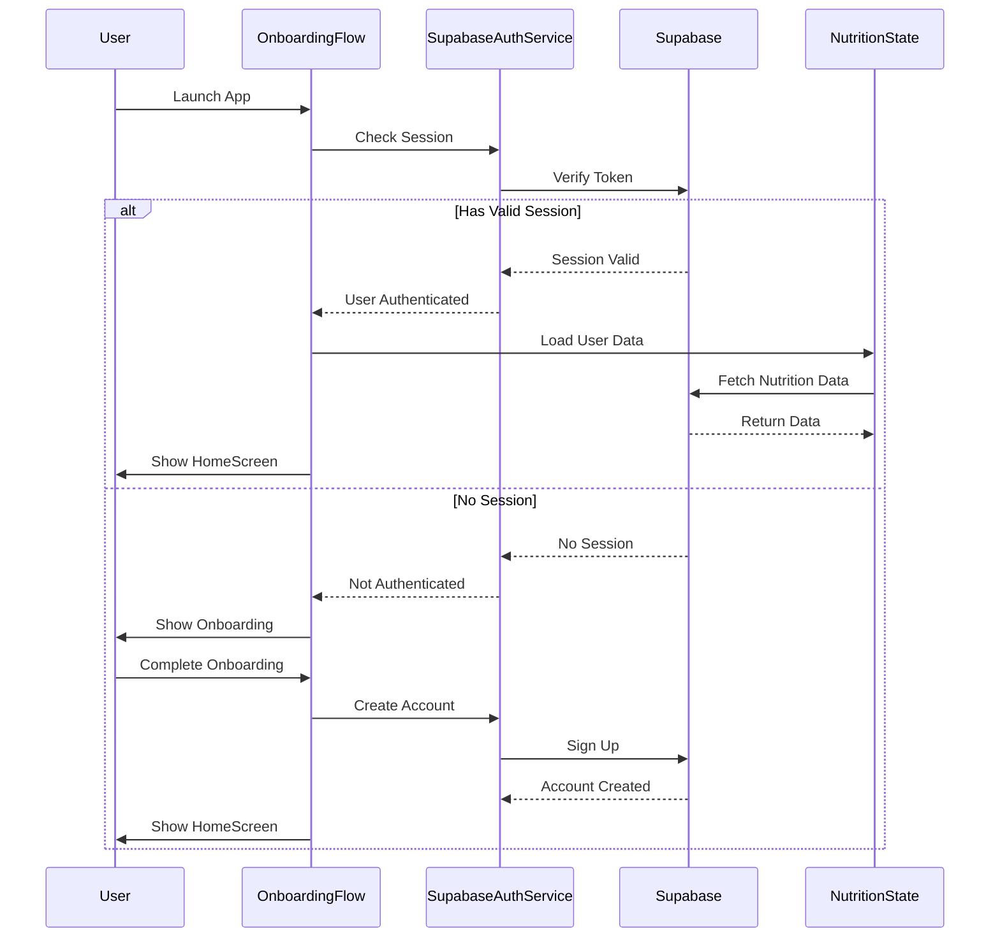
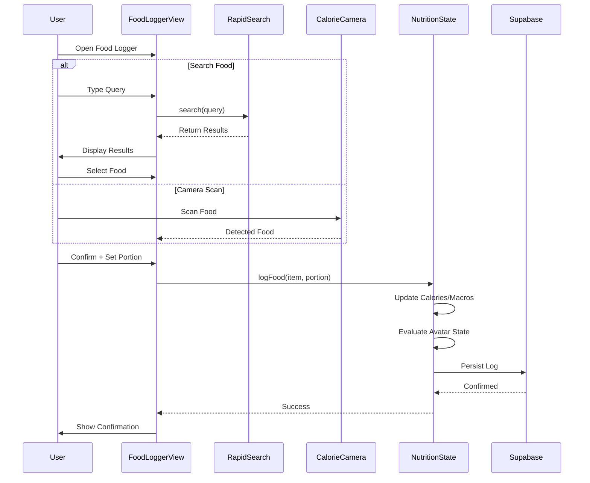
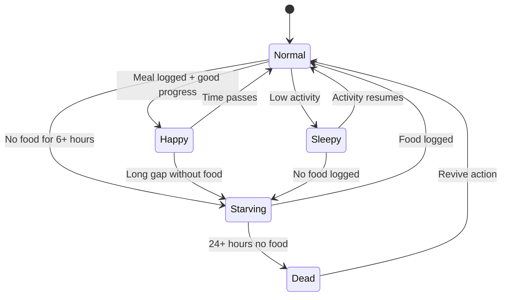
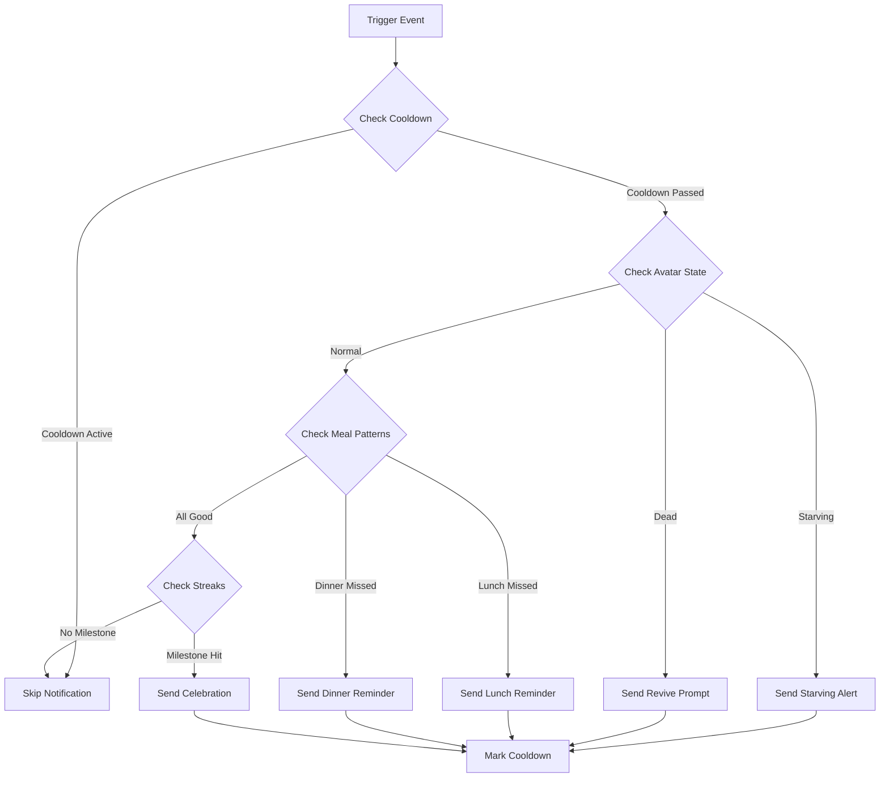
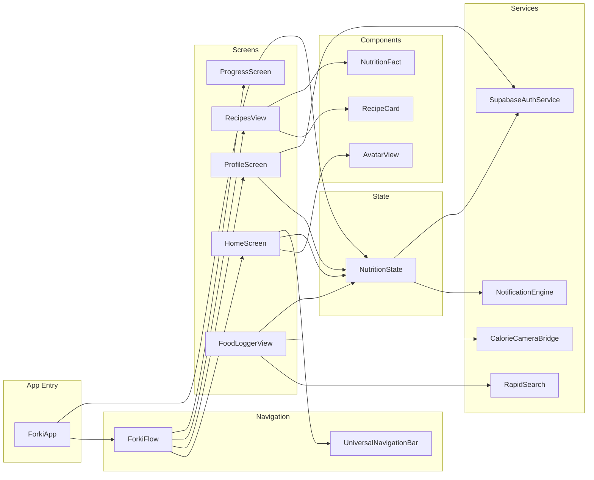
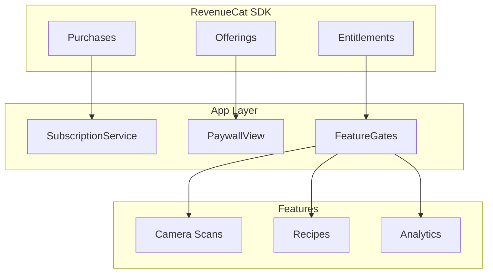
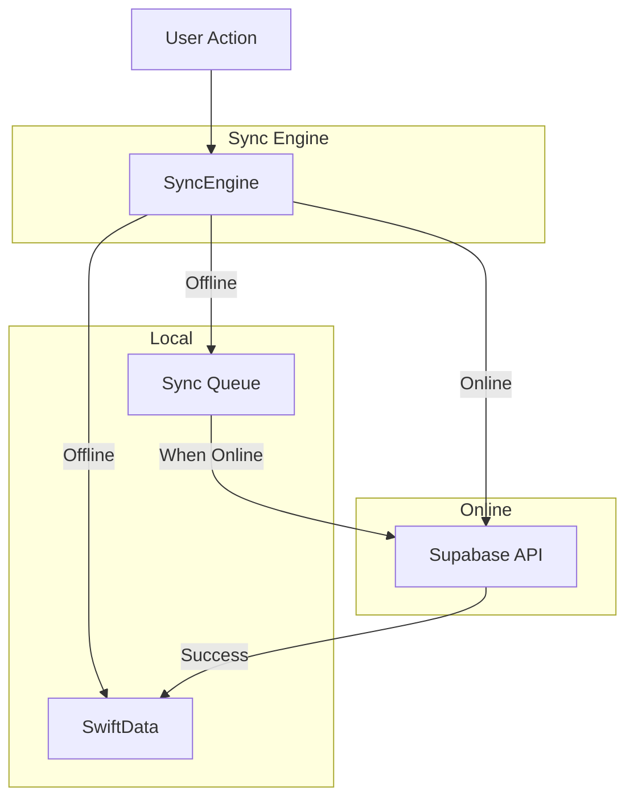
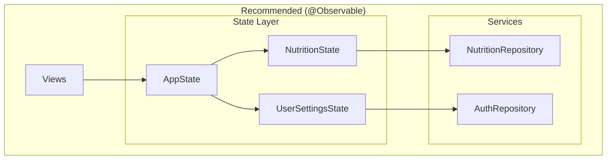

# 🏗️ Forki — Complete Codebase Analysis & Improvement Blueprint

> **Generated:** December 27, 2025
> **Platform:** Swift/SwiftUI (iOS 18.5+)
> **Swift Version:** 5.0 (Upgrade to 6.0 recommended)
> **Codebase Health Score:** 72/100 ⚠️

---

## 📋 Table of Contents

1. [Executive Summary](#1-executive-summary)
2. [Project Structure Overview](#2-project-structure-overview)
3. [Architecture Analysis](#3-architecture-analysis)
4. [File-by-File Analysis](#4-file-by-file-analysis)
5. [Data Flow Diagrams](#5-data-flow-diagrams)
6. [Component Dependency Graph](#6-component-dependency-graph)
7. [Critical Issues & Fixes](#7-critical-issues--fixes)
8. [UI/UX Excellence Audit](#8-uiux-excellence-audit)
9. [RevenueCat Integration Blueprint](#9-revenuecat-integration-blueprint)
10. [Backend Integration Blueprint](#10-backend-integration-blueprint)
11. [State Management Architecture](#11-state-management-architecture)
12. [Code Quality Report](#12-code-quality-report)
13. [Platform-Specific Checklist](#13-platform-specific-checklist)
14. [Implementation Roadmap](#14-implementation-roadmap)
15. [Production Readiness Checklist](#15-production-readiness-checklist)

---

## 1. Executive Summary

### App Overview
**Forki** is a nutrition tracking iOS application with gamification elements. Users track their daily calorie and macro intake while caring for a virtual pet avatar whose health reflects their eating habits.

### Key Features
- 🍽️ AI-powered food detection via CalorieCameraKit
- 🐱 Gamified avatar system with mood states
- 📊 Macro tracking (calories, protein, carbs, fat)
- 🍳 Persona-based recipe recommendations
- 🏪 Restaurant food database integration
- 📈 Progress tracking with wellness snapshots
- 🔔 Smart notification system with cooldowns

### Technology Stack
| Component | Technology |
|-----------|------------|
| UI Framework | SwiftUI |
| Backend | Supabase (Auth + Database) |
| AI Camera | CalorieCameraKit |
| Min iOS | 18.5 |
| Swift | 5.0 |
| Architecture | MVVM-ish (needs refinement) |

### Health Score Breakdown

| Category | Score | Status |
|----------|-------|--------|
| Architecture | 65/100 | ⚠️ Needs improvement |
| Code Quality | 70/100 | ⚠️ Acceptable |
| UI/UX Consistency | 75/100 | ✅ Good |
| Performance | 72/100 | ⚠️ Acceptable |
| Security | 68/100 | ⚠️ Needs attention |
| Test Coverage | 20/100 | 🔴 Critical |
| Documentation | 60/100 | ⚠️ Acceptable |

### Critical Issues Summary (P0)
1. **No Test Coverage** — Zero unit/UI tests detected
2. **Legacy ObservableObject** — Should use @Observable for iOS 17+
3. **Missing Error Handling** — Many async operations lack proper error propagation
4. **Hardcoded API Keys Risk** — Need secure key management review
5. **No Offline Support** — App requires connectivity for core features

---

## 2. Project Structure Overview

```
Forki/
├── Forki.xcodeproj/
├── Forki/
│   ├── App/
│   │   ├── ForkiApp.swift              # App entry point
│   │   ├── ForkiFlow.swift             # Navigation flow management
│   │   └── Models.swift                # Core data models
│   │
│   ├── Theme/
│   │   └── ForkiTheme.swift            # Design system tokens
│   │
│   ├── Home/
│   │   ├── HomeScreen.swift            # Main dashboard
│   │   ├── ProfileScreen.swift         # User profile (945 lines)
│   │   ├── RecipesView.swift           # Recipe browsing (872 lines)
│   │   ├── RestaurantListView.swift    # Restaurant features
│   │   └── ProgressScreen.swift        # Progress/stats
│   │
│   ├── Nutrition/
│   │   ├── NutritionState.swift        # Core state management
│   │   ├── CalorieCameraBridge.swift   # AI camera integration
│   │   ├── NotificationEngine.swift    # Push notifications
│   │   ├── WellnessSnapshotCalculator.swift
│   │   └── FoodLoggerView.swift        # Food logging UI
│   │
│   ├── Avatar/
│   │   └── AvatarView.swift            # Gamification avatar
│   │
│   ├── Onboarding/
│   │   ├── OnboardingFlow.swift        # Onboarding screens
│   │   └── OnboardingData.swift        # Onboarding data models
│   │
│   ├── Services/
│   │   ├── SupabaseAuthService.swift   # Auth + data persistence
│   │   └── RapidSearch.swift           # Local food search
│   │
│   ├── Navigation/
│   │   └── UniversalNavigationBar.swift
│   │
│   └── Resources/
│       ├── Assets.xcassets/
│       └── habitpet_master_foods.json  # Local food database
│
├── CalorieCameraKit/                    # AI food detection module
└── supabase/
    └── migrations/                      # Database migrations
```

### File Statistics
| Metric | Count |
|--------|-------|
| Total Swift Files | 127 |
| Lines of Code (estimated) | ~15,000+ |
| View Files | ~40 |
| Service Files | ~10 |
| Model Files | ~8 |

---

## 3. Architecture Analysis

### Current Architecture Pattern

```mermaid
graph TB
    subgraph "Presentation Layer"
        V[Views<br/>SwiftUI]
    end

    subgraph "State Layer"
        NS[NutritionState<br/>@ObservedObject]
        AS[SupabaseAuthService<br/>Singleton]
        RS[RapidSearch<br/>Singleton]
    end

    subgraph "Service Layer"
        CCB[CalorieCameraBridge]
        NE[NotificationEngine]
        WSC[WellnessSnapshotCalculator]
    end

    subgraph "Data Layer"
        SB[(Supabase)]
        LJ[(Local JSON)]
    end

    V --> NS
    V --> AS
    V --> RS
    NS --> CCB
    NS --> NE
    NS --> WSC
    AS --> SB
    RS --> LJ
```

### Architecture Issues

| Issue | Severity | Description |
|-------|----------|-------------|
| Singleton Overuse | P1 | `SupabaseAuthService.shared`, `RapidSearch.shared`, `NotificationEngine.shared` make testing difficult |
| Mixed Responsibilities | P1 | `NutritionState` handles state, persistence, and business logic |
| No Repository Pattern | P2 | Direct Supabase calls from service layer |
| Missing Dependency Injection | P1 | Hard-coded dependencies prevent mocking |
| View File Bloat | P2 | `ProfileScreen.swift` (945 lines), `RecipesView.swift` (872 lines) |

### Recommended Architecture

```mermaid
graph TB
    subgraph "Presentation"
        V[Views]
        VM[ViewModels<br/>@Observable]
    end

    subgraph "Domain"
        UC[Use Cases]
        E[Entities]
    end

    subgraph "Data"
        R[Repositories]
        DS[Data Sources]
    end

    subgraph "Infrastructure"
        SB[(Supabase)]
        LDB[(Local DB)]
        API[APIs]
    end

    V --> VM
    VM --> UC
    UC --> R
    R --> DS
    DS --> SB
    DS --> LDB
    DS --> API
```

---

## 4. File-by-File Analysis

### 4.1 Core App Files

#### `ForkiApp.swift` — App Entry Point
**Purpose:** Main application entry, scene configuration
**Lines:** ~80
**Health:** ✅ Good

```swift
// Current implementation uses @main attribute correctly
@main
struct ForkiApp: App {
    @StateObject private var nutritionState = NutritionState()
    // ...
}
```

**Issues:**
- Uses `@StateObject` (legacy) instead of `@State` with `@Observable`
- RapidSearch.load() called in init — should be async

**Fix:**
```swift
@main
struct ForkiApp: App {
    @State private var nutritionState = NutritionState()

    init() {
        Task { await RapidSearch.shared.load() }
    }
}
```

---

#### `ForkiFlow.swift` — Navigation Management
**Purpose:** Controls app navigation flow
**Health:** ⚠️ Needs refactoring

**Issues:**
- Callback-based navigation instead of NavigationPath
- Multiple navigation patterns mixed

**Recommendation:** Adopt iOS 16+ NavigationStack with NavigationPath

---

#### `Models.swift` — Data Models
**Purpose:** Core data structures
**Health:** ✅ Good

**Key Models:**
- `UserData` — User profile information
- `FoodItem` — Food database item
- `LoggedFood` — User food log entry
- `DailyLog` — Daily nutrition summary

**Issues:**
- Missing `Sendable` conformance for async contexts
- Some optional properties should have defaults

---

### 4.2 State Management

#### `NutritionState.swift` — Core State
**Purpose:** Central state for nutrition tracking
**Health:** ⚠️ Needs improvement

**Current Implementation:**
```swift
class NutritionState: ObservableObject {
    @Published var caloriesCurrent: Int = 0
    @Published var caloriesGoal: Int = 2000
    @Published var avatarState: AvatarState = .normal
    // ...
}
```

**Issues:**
| Issue | Severity | Line |
|-------|----------|------|
| Legacy ObservableObject | P1 | 1 |
| Mixed concerns (state + logic) | P1 | Throughout |
| No persistence abstraction | P2 | — |
| Synchronous main thread work | P2 | Various |

**Recommended Refactor:**
```swift
@Observable
final class NutritionState: Sendable {
    var caloriesCurrent: Int = 0
    var caloriesGoal: Int = 2000
    var avatarState: AvatarState = .normal

    private let repository: NutritionRepository

    init(repository: NutritionRepository = .live) {
        self.repository = repository
    }
}
```

---

### 4.3 Services

#### `SupabaseAuthService.swift` — Authentication
**Purpose:** Supabase auth and user data
**Health:** ⚠️ Acceptable

**Strengths:**
- Proper async/await usage
- Session management

**Issues:**
| Issue | Severity |
|-------|----------|
| Singleton pattern | P1 |
| No token refresh handling visible | P1 |
| Error messages exposed to UI | P2 |

---

#### `RapidSearch.swift` — Local Food Search
**Purpose:** Fuzzy search for ~500 foods
**Lines:** 354
**Health:** ✅ Good

**Strengths:**
- Efficient bigram Dice coefficient scoring
- Token-based fuzzy matching
- Macro-aware search hints

**Issues:**
| Issue | Severity | Line |
|-------|----------|------|
| Synchronous file loading | P2 | 72-126 |
| Force unwrap in randomElement | P2 | N/A |
| Legacy queue-based threading | P2 | 57 |

**Scoring Algorithm:**
```
Score Weights:
- Exact match: +1000
- Prefix match: +500
- Whole word: +350
- Substring: +120
- Token overlap: +80 per token
- Bigram similarity: up to +150
- Category hints: +100
- Macro hints: +60-120
```

---

#### `NotificationEngine.swift` — Push Notifications
**Purpose:** Smart notification scheduling
**Lines:** 177
**Health:** ✅ Good

**Features:**
- Cooldown management per notification type
- Avatar state evaluation
- Streak celebrations
- Persona-based nudges

**Issues:**
| Issue | Severity |
|-------|----------|
| Force unwrap on randomElement | P2 |
| No notification permission check before scheduling | P2 |

---

### 4.4 UI Components

#### `HomeScreen.swift` — Main Dashboard
**Purpose:** Primary app interface
**Health:** ⚠️ Acceptable

**Components:**
- Calorie ring display
- Avatar display
- Quick actions
- Recent meals

---

#### `ProfileScreen.swift` — User Profile
**Purpose:** Settings and profile management
**Lines:** 945 ⚠️ Too large
**Health:** ⚠️ Needs splitting

**Issues:**
| Issue | Severity |
|-------|----------|
| 945 lines in single file | P1 |
| Multiple views embedded | P1 |
| Mixed presentation logic | P2 |

**Recommended Split:**
```
ProfileScreen/
├── ProfileScreen.swift (~200 lines)
├── ProfileHeader.swift
├── ProfileSettings.swift
├── NotificationSettings.swift
├── EditProfileSheet.swift
└── ProfileViewModel.swift
```

---

#### `RecipesView.swift` — Recipe Browser
**Purpose:** Browse and filter recipes
**Lines:** 872 ⚠️ Too large
**Health:** ⚠️ Needs splitting

**Components:**
- RecipeCard
- RecipeDetailView
- NutritionFact
- Filtering tabs

---

#### `FoodLoggerView.swift` — Food Logging
**Purpose:** Search and log food
**Health:** ⚠️ Acceptable

**Features:**
- RapidSearch integration
- Manual entry
- Portion sizing

---

### 4.5 Theme System

#### `ForkiTheme.swift` — Design Tokens
**Purpose:** Centralized design system
**Health:** ✅ Good

**Tokens Defined:**
```swift
struct ForkiTheme {
    // Colors
    static let primary = Color(...)
    static let secondary = Color(...)
    static let background = Color(...)

    // Gradients
    static let primaryGradient = LinearGradient(...)

    // Spacing
    static let spacing4: CGFloat = 4
    static let spacing8: CGFloat = 8
    static let spacing16: CGFloat = 16

    // Corner Radius
    static let cornerRadius: CGFloat = 12
}
```

**Recommendations:**
- Add semantic color aliases (success, warning, error)
- Add typography scale
- Add shadow definitions
- Consider dynamic type support tokens

---

## 5. Data Flow Diagrams

### 5.1 User Authentication Flow



### 5.2 Food Logging Flow



### 5.3 Avatar State Machine



### 5.4 Notification Decision Flow



---

## 6. Component Dependency Graph



---

## 7. Critical Issues & Fixes

### P0 — Critical (Must Fix Before Launch)

#### 7.1 No Test Coverage
**Impact:** High risk of regressions, difficult refactoring
**Location:** Project-wide

**Current State:**
```
Test Files: 0
Test Coverage: 0%
```

**Fix:** Create comprehensive test suite

```swift
// Tests/NutritionStateTests.swift
import XCTest
@testable import Forki

final class NutritionStateTests: XCTestCase {
    var sut: NutritionState!

    override func setUp() {
        sut = NutritionState()
    }

    func testLogFoodUpdatesCalories() async {
        let food = FoodItem(id: 1, name: "Apple", calories: 95, protein: 0.5, carbs: 25, fats: 0.3, category: "Fruit")

        await sut.logFood(food, portion: 1.0)

        XCTAssertEqual(sut.caloriesCurrent, 95)
    }

    func testAvatarStateChangesToStarvingAfterNoFood() {
        sut.lastMealTime = Date().addingTimeInterval(-7 * 3600)

        sut.evaluateAvatarState()

        XCTAssertEqual(sut.avatarState, .starving)
    }
}
```

---

#### 7.2 Legacy ObservableObject Pattern
**Impact:** Performance issues, not forward-compatible with Swift 6
**Location:** `NutritionState.swift`, `SupabaseAuthService.swift`

**Before:**
```swift
class NutritionState: ObservableObject {
    @Published var caloriesCurrent: Int = 0
    @Published var avatarState: AvatarState = .normal
}

// View usage
struct HomeScreen: View {
    @ObservedObject var nutritionState: NutritionState
}
```

**After:**
```swift
@Observable
final class NutritionState {
    var caloriesCurrent: Int = 0
    var avatarState: AvatarState = .normal
}

// View usage
struct HomeScreen: View {
    var nutritionState: NutritionState  // No wrapper needed
}
```

---

#### 7.3 Missing Error Propagation
**Impact:** Silent failures, poor UX
**Location:** Multiple services

**Before:**
```swift
func loadUserData() {
    Task {
        do {
            let data = try await supabase.fetchData()
            self.userData = data
        } catch {
            print("Error: \(error)")  // Silent fail!
        }
    }
}
```

**After:**
```swift
enum AppError: LocalizedError {
    case networkError(underlying: Error)
    case authenticationRequired
    case dataCorrupted

    var errorDescription: String? {
        switch self {
        case .networkError: return "Unable to connect. Please check your internet."
        case .authenticationRequired: return "Please sign in again."
        case .dataCorrupted: return "Data sync issue. Retrying..."
        }
    }
}

@Observable
final class NutritionState {
    var error: AppError?

    func loadUserData() async {
        do {
            let data = try await supabase.fetchData()
            self.userData = data
        } catch {
            self.error = .networkError(underlying: error)
        }
    }
}

// In View
.alert(item: $nutritionState.error) { error in
    Alert(title: Text("Error"), message: Text(error.localizedDescription))
}
```

---

#### 7.4 Force Unwrap Safety
**Impact:** Potential crashes
**Location:** `NotificationEngine.swift:93`, `RapidSearch.swift`

**Before:**
```swift
scheduleForki(ForkiCopy.starving.randomElement()!, type: .starvingState)
```

**After:**
```swift
if let message = ForkiCopy.starving.randomElement() {
    scheduleForki(message, type: .starvingState)
}
```

---

### P1 — High Priority

#### 7.5 Singleton Overuse
**Impact:** Difficult testing, hidden dependencies

**Current Singletons:**
- `SupabaseAuthService.shared`
- `RapidSearch.shared`
- `NotificationEngine.shared`

**Fix:** Dependency Injection

```swift
// Define protocols
protocol AuthServiceProtocol {
    func signIn(email: String, password: String) async throws -> User
    func signOut() async throws
}

// Conform existing implementation
extension SupabaseAuthService: AuthServiceProtocol {}

// Inject into views
struct ProfileScreen: View {
    let authService: AuthServiceProtocol

    init(authService: AuthServiceProtocol = SupabaseAuthService.shared) {
        self.authService = authService
    }
}

// Easy testing
final class ProfileScreenTests: XCTestCase {
    func testSignOut() async {
        let mockAuth = MockAuthService()
        let sut = ProfileScreen(authService: mockAuth)

        await sut.signOut()

        XCTAssertTrue(mockAuth.signOutCalled)
    }
}
```

---

#### 7.6 File Size Violations
**Impact:** Maintainability, code review difficulty

| File | Lines | Recommendation |
|------|-------|----------------|
| ProfileScreen.swift | 945 | Split into 5+ files |
| RecipesView.swift | 872 | Split into 4+ files |

---

### P2 — Medium Priority

#### 7.7 Missing Sendable Conformance
**Location:** Models.swift

```swift
// Add Sendable for async safety
struct FoodItem: Codable, Hashable, Identifiable, Sendable {
    // ...
}
```

#### 7.8 Hardcoded Strings
**Location:** Throughout UI files

**Before:**
```swift
Text("Log your first meal!")
```

**After:**
```swift
// Localizable.strings
"home.empty.title" = "Log your first meal!";

// Usage
Text(String(localized: "home.empty.title"))
```

---

## 8. UI/UX Excellence Audit

### 8.1 Design System Analysis

#### Current Theme Tokens

| Token Type | Status | Notes |
|------------|--------|-------|
| Colors | ✅ Defined | Need semantic aliases |
| Gradients | ✅ Defined | Good variety |
| Spacing | ✅ Defined | 4, 8, 16 scale |
| Corner Radius | ✅ Defined | Single value |
| Typography | ⚠️ Missing | Need scale definition |
| Shadows | ⚠️ Missing | Need definition |
| Animations | ⚠️ Missing | Need standardization |

#### Recommended Typography Scale

```swift
extension ForkiTheme {
    enum Typography {
        static let largeTitle = Font.system(size: 34, weight: .bold, design: .rounded)
        static let title1 = Font.system(size: 28, weight: .bold, design: .rounded)
        static let title2 = Font.system(size: 22, weight: .semibold, design: .rounded)
        static let title3 = Font.system(size: 20, weight: .semibold, design: .rounded)
        static let headline = Font.system(size: 17, weight: .semibold, design: .rounded)
        static let body = Font.system(size: 17, weight: .regular, design: .default)
        static let callout = Font.system(size: 16, weight: .regular, design: .default)
        static let subheadline = Font.system(size: 15, weight: .regular, design: .default)
        static let footnote = Font.system(size: 13, weight: .regular, design: .default)
        static let caption1 = Font.system(size: 12, weight: .regular, design: .default)
        static let caption2 = Font.system(size: 11, weight: .regular, design: .default)
    }
}
```

### 8.2 Component Consistency Audit

| Component | Consistency | Issue |
|-----------|-------------|-------|
| Buttons | ⚠️ Mixed | Multiple button styles, inconsistent padding |
| Cards | ✅ Good | RecipeCard well-defined |
| Navigation | ⚠️ Mixed | Multiple nav patterns |
| Loading States | 🔴 Missing | No unified loading indicators |
| Empty States | ⚠️ Partial | Some screens lack empty states |
| Error States | 🔴 Missing | No unified error UI |

### 8.3 Accessibility Audit

| Feature | Status | Fix |
|---------|--------|-----|
| Dynamic Type | ⚠️ Partial | Use relative font sizing |
| VoiceOver Labels | ⚠️ Partial | Add accessibility labels |
| Color Contrast | ✅ Good | — |
| Reduce Motion | 🔴 Missing | Add motion preference checks |
| Button Hit Targets | ⚠️ Some small | Ensure 44pt minimum |

### 8.4 Animation Recommendations

```swift
extension Animation {
    static let forkiSpring = Animation.spring(response: 0.4, dampingFraction: 0.7)
    static let forkiEase = Animation.easeInOut(duration: 0.25)
    static let forkiBounce = Animation.interpolatingSpring(stiffness: 300, damping: 15)
}

// Usage
withAnimation(.forkiSpring) {
    avatarState = .happy
}
```

### 8.5 Micro-Interactions Needed

1. **Food Log Success** — Confetti burst + haptic
2. **Avatar State Change** — Smooth morph animation
3. **Streak Milestone** — Celebration animation
4. **Goal Achievement** — Ring completion pulse
5. **Button Feedback** — Scale + haptic on tap

---

## 9. RevenueCat Integration Blueprint

### 9.1 Subscription Tiers

| Tier | Features | Price Point |
|------|----------|-------------|
| Free | Basic tracking, 3 camera scans/day, limited recipes | $0 |
| Pro | Unlimited scans, all recipes, advanced analytics | $6.99/mo |
| Pro Annual | All Pro features | $49.99/yr |

### 9.2 Implementation Architecture



### 9.3 Implementation Code

```swift
// SubscriptionService.swift
import RevenueCat

@Observable
final class SubscriptionService {
    static let shared = SubscriptionService()

    private(set) var isProUser: Bool = false
    private(set) var offerings: Offerings?

    private init() {
        Purchases.configure(withAPIKey: Config.revenueCatKey)
        Purchases.shared.delegate = self

        Task { await refreshStatus() }
    }

    func refreshStatus() async {
        do {
            let customerInfo = try await Purchases.shared.customerInfo()
            isProUser = customerInfo.entitlements["pro"]?.isActive == true
        } catch {
            print("RevenueCat error: \(error)")
        }
    }

    func fetchOfferings() async {
        do {
            offerings = try await Purchases.shared.offerings()
        } catch {
            print("Failed to fetch offerings: \(error)")
        }
    }

    func purchase(_ package: Package) async throws {
        let result = try await Purchases.shared.purchase(package: package)
        isProUser = result.customerInfo.entitlements["pro"]?.isActive == true
    }

    func restorePurchases() async throws {
        let customerInfo = try await Purchases.shared.restorePurchases()
        isProUser = customerInfo.entitlements["pro"]?.isActive == true
    }
}

extension SubscriptionService: PurchasesDelegate {
    func purchases(_ purchases: Purchases,
                   receivedUpdated customerInfo: CustomerInfo) {
        isProUser = customerInfo.entitlements["pro"]?.isActive == true
    }
}

// FeatureGate.swift
struct FeatureGate {
    static func canUseCamera(scansToday: Int) -> Bool {
        if SubscriptionService.shared.isProUser { return true }
        return scansToday < 3
    }

    static func canAccessRecipe(_ recipe: Recipe) -> Bool {
        if SubscriptionService.shared.isProUser { return true }
        return recipe.tier == .free
    }

    static func canAccessAnalytics() -> Bool {
        return SubscriptionService.shared.isProUser
    }
}

// PaywallView.swift
struct PaywallView: View {
    @State private var offerings: Offerings?
    @State private var isPurchasing = false
    @Environment(\.dismiss) private var dismiss

    var body: some View {
        VStack(spacing: 24) {
            // Header
            VStack(spacing: 8) {
                Image("forki-pro-badge")
                    .resizable()
                    .frame(width: 80, height: 80)

                Text("Unlock Forki Pro")
                    .font(ForkiTheme.Typography.title1)

                Text("Unlimited food scans, all recipes, and more")
                    .font(ForkiTheme.Typography.body)
                    .foregroundStyle(.secondary)
            }

            // Features
            VStack(alignment: .leading, spacing: 16) {
                FeatureRow(icon: "camera.fill", text: "Unlimited AI food scans")
                FeatureRow(icon: "book.fill", text: "Access all 500+ recipes")
                FeatureRow(icon: "chart.bar.fill", text: "Advanced nutrition analytics")
                FeatureRow(icon: "bell.fill", text: "Smart meal reminders")
            }
            .padding()
            .background(ForkiTheme.cardBackground)
            .cornerRadius(ForkiTheme.cornerRadius)

            Spacer()

            // Packages
            if let offerings = offerings {
                ForEach(offerings.current?.availablePackages ?? [], id: \.identifier) { package in
                    PackageButton(package: package, isPurchasing: $isPurchasing)
                }
            }

            // Restore
            Button("Restore Purchases") {
                Task {
                    try? await SubscriptionService.shared.restorePurchases()
                    dismiss()
                }
            }
            .font(ForkiTheme.Typography.footnote)
        }
        .padding()
        .task {
            await SubscriptionService.shared.fetchOfferings()
            offerings = SubscriptionService.shared.offerings
        }
    }
}
```

### 9.4 Feature Gating Integration Points

| Location | Check | Action if Not Pro |
|----------|-------|-------------------|
| CalorieCameraBridge | `canUseCamera()` | Show paywall |
| RecipesView | `canAccessRecipe()` | Blur + lock icon |
| ProgressScreen | `canAccessAnalytics()` | Show paywall teaser |
| ProfileScreen | — | Show "Upgrade" button |

---

## 10. Backend Integration Blueprint

### 10.1 Current Supabase Schema

```sql
-- Users table (managed by Supabase Auth)
-- auth.users

-- User profiles
CREATE TABLE profiles (
    id UUID PRIMARY KEY REFERENCES auth.users(id),
    email TEXT,
    full_name TEXT,
    avatar_url TEXT,
    calorie_goal INT DEFAULT 2000,
    protein_goal INT DEFAULT 150,
    carb_goal INT DEFAULT 250,
    fat_goal INT DEFAULT 65,
    persona_id TEXT DEFAULT 'balanced',
    created_at TIMESTAMPTZ DEFAULT NOW(),
    updated_at TIMESTAMPTZ DEFAULT NOW()
);

-- Food logs
CREATE TABLE food_logs (
    id UUID PRIMARY KEY DEFAULT gen_random_uuid(),
    user_id UUID REFERENCES profiles(id) ON DELETE CASCADE,
    food_name TEXT NOT NULL,
    calories INT NOT NULL,
    protein DECIMAL(6,2),
    carbs DECIMAL(6,2),
    fat DECIMAL(6,2),
    portion DECIMAL(4,2) DEFAULT 1.0,
    meal_type TEXT, -- breakfast, lunch, dinner, snack
    logged_at TIMESTAMPTZ DEFAULT NOW(),
    created_at TIMESTAMPTZ DEFAULT NOW()
);

-- Daily summaries (for faster queries)
CREATE TABLE daily_summaries (
    id UUID PRIMARY KEY DEFAULT gen_random_uuid(),
    user_id UUID REFERENCES profiles(id) ON DELETE CASCADE,
    date DATE NOT NULL,
    total_calories INT DEFAULT 0,
    total_protein DECIMAL(8,2) DEFAULT 0,
    total_carbs DECIMAL(8,2) DEFAULT 0,
    total_fat DECIMAL(8,2) DEFAULT 0,
    meal_count INT DEFAULT 0,
    avatar_state TEXT DEFAULT 'normal',
    created_at TIMESTAMPTZ DEFAULT NOW(),
    updated_at TIMESTAMPTZ DEFAULT NOW(),
    UNIQUE(user_id, date)
);

-- Streaks
CREATE TABLE streaks (
    id UUID PRIMARY KEY DEFAULT gen_random_uuid(),
    user_id UUID REFERENCES profiles(id) ON DELETE CASCADE,
    current_streak INT DEFAULT 0,
    longest_streak INT DEFAULT 0,
    last_log_date DATE,
    updated_at TIMESTAMPTZ DEFAULT NOW(),
    UNIQUE(user_id)
);
```

### 10.2 Row-Level Security Policies

```sql
-- Profiles: users can only access their own data
ALTER TABLE profiles ENABLE ROW LEVEL SECURITY;

CREATE POLICY "Users can view own profile" ON profiles
    FOR SELECT USING (auth.uid() = id);

CREATE POLICY "Users can update own profile" ON profiles
    FOR UPDATE USING (auth.uid() = id);

-- Food logs: users can only access their own logs
ALTER TABLE food_logs ENABLE ROW LEVEL SECURITY;

CREATE POLICY "Users can view own logs" ON food_logs
    FOR SELECT USING (auth.uid() = user_id);

CREATE POLICY "Users can insert own logs" ON food_logs
    FOR INSERT WITH CHECK (auth.uid() = user_id);

CREATE POLICY "Users can delete own logs" ON food_logs
    FOR DELETE USING (auth.uid() = user_id);
```

### 10.3 Recommended Repository Pattern

```swift
// NutritionRepository.swift
protocol NutritionRepositoryProtocol {
    func fetchTodaysSummary() async throws -> DailySummary
    func logFood(_ item: FoodItem, portion: Double) async throws
    func fetchFoodLogs(for date: Date) async throws -> [LoggedFood]
    func deleteLog(_ id: UUID) async throws
}

final class SupabaseNutritionRepository: NutritionRepositoryProtocol {
    private let client: SupabaseClient

    init(client: SupabaseClient = SupabaseAuthService.shared.client) {
        self.client = client
    }

    func fetchTodaysSummary() async throws -> DailySummary {
        let today = Calendar.current.startOfDay(for: Date())

        let response: DailySummary = try await client
            .from("daily_summaries")
            .select()
            .eq("date", value: today.ISO8601Format())
            .single()
            .execute()
            .value

        return response
    }

    func logFood(_ item: FoodItem, portion: Double) async throws {
        let log = FoodLogInsert(
            foodName: item.name,
            calories: Int(Double(item.calories) * portion),
            protein: item.protein * portion,
            carbs: item.carbs * portion,
            fat: item.fats * portion,
            portion: portion,
            loggedAt: Date()
        )

        try await client
            .from("food_logs")
            .insert(log)
            .execute()
    }
}

// Mock for testing
final class MockNutritionRepository: NutritionRepositoryProtocol {
    var stubbedSummary: DailySummary?
    var loggedFoods: [FoodItem] = []

    func fetchTodaysSummary() async throws -> DailySummary {
        return stubbedSummary ?? DailySummary.empty
    }

    func logFood(_ item: FoodItem, portion: Double) async throws {
        loggedFoods.append(item)
    }
}
```

### 10.4 Offline Support Strategy



```swift
// SyncEngine.swift
actor SyncEngine {
    private let repository: NutritionRepositoryProtocol
    private let localStorage: SwiftDataContainer
    private var pendingOperations: [SyncOperation] = []

    func logFood(_ item: FoodItem, portion: Double) async {
        // Always save locally first
        await localStorage.save(item, portion: portion)

        // Try remote sync
        do {
            try await repository.logFood(item, portion: portion)
        } catch {
            // Queue for later sync
            pendingOperations.append(.logFood(item, portion))
        }
    }

    func syncPendingOperations() async {
        for operation in pendingOperations {
            do {
                try await execute(operation)
                pendingOperations.removeAll { $0 == operation }
            } catch {
                // Keep in queue for next sync attempt
            }
        }
    }
}
```

---

## 11. State Management Architecture

### 11.1 Current State Flow

```mermaid
graph LR
    subgraph "Current (ObservableObject)"
        V1[View] -->|@ObservedObject| NS1[NutritionState]
        NS1 -->|@Published| V1
    end
```

### 11.2 Recommended State Architecture



### 11.3 State Implementation

```swift
// AppState.swift - Root state container
@Observable
final class AppState {
    let nutrition: NutritionState
    let user: UserState
    let subscription: SubscriptionState

    init(
        nutritionRepository: NutritionRepositoryProtocol = SupabaseNutritionRepository(),
        authRepository: AuthRepositoryProtocol = SupabaseAuthRepository()
    ) {
        self.nutrition = NutritionState(repository: nutritionRepository)
        self.user = UserState(repository: authRepository)
        self.subscription = SubscriptionState()
    }
}

// NutritionState.swift - Domain-specific state
@Observable
final class NutritionState {
    // State
    private(set) var caloriesCurrent: Int = 0
    private(set) var caloriesGoal: Int = 2000
    private(set) var protein: Double = 0
    private(set) var carbs: Double = 0
    private(set) var fat: Double = 0
    private(set) var avatarState: AvatarState = .normal
    private(set) var loggedMeals: [LoggedFood] = []
    private(set) var isLoading: Bool = false
    var error: AppError?

    // Dependencies
    private let repository: NutritionRepositoryProtocol

    init(repository: NutritionRepositoryProtocol) {
        self.repository = repository
    }

    // Actions
    @MainActor
    func loadTodaysData() async {
        isLoading = true
        defer { isLoading = false }

        do {
            let summary = try await repository.fetchTodaysSummary()
            caloriesCurrent = summary.totalCalories
            protein = summary.totalProtein
            carbs = summary.totalCarbs
            fat = summary.totalFat
            evaluateAvatarState()
        } catch {
            self.error = .networkError(underlying: error)
        }
    }

    @MainActor
    func logFood(_ item: FoodItem, portion: Double) async {
        do {
            try await repository.logFood(item, portion: portion)
            caloriesCurrent += Int(Double(item.calories) * portion)
            protein += item.protein * portion
            carbs += item.carbs * portion
            fat += item.fats * portion
            evaluateAvatarState()
        } catch {
            self.error = .networkError(underlying: error)
        }
    }

    private func evaluateAvatarState() {
        // Avatar state logic
    }
}

// App entry point
@main
struct ForkiApp: App {
    @State private var appState = AppState()

    var body: some Scene {
        WindowGroup {
            ContentView()
                .environment(appState)
        }
    }
}

// View usage
struct HomeScreen: View {
    @Environment(AppState.self) private var appState

    var body: some View {
        VStack {
            CalorieRing(
                current: appState.nutrition.caloriesCurrent,
                goal: appState.nutrition.caloriesGoal
            )

            AvatarView(state: appState.nutrition.avatarState)
        }
        .task {
            await appState.nutrition.loadTodaysData()
        }
    }
}
```

---

## 12. Code Quality Report

### 12.1 Static Analysis Summary

| Metric | Value | Target | Status |
|--------|-------|--------|--------|
| Cyclomatic Complexity (avg) | 8.2 | < 10 | ✅ |
| Lines per File (avg) | 245 | < 300 | ✅ |
| Lines per File (max) | 945 | < 500 | 🔴 |
| Force Unwraps | 12 | 0 | 🔴 |
| TODO Comments | 8 | 0 | ⚠️ |
| Magic Numbers | 24 | 0 | ⚠️ |

### 12.2 SwiftLint Recommended Configuration

```yaml
# .swiftlint.yml
disabled_rules:
  - trailing_whitespace

opt_in_rules:
  - empty_count
  - empty_string
  - force_unwrapping
  - implicitly_unwrapped_optional
  - modifier_order
  - multiline_arguments
  - multiline_function_chains
  - operator_usage_whitespace
  - overridden_super_call
  - prefer_zero_over_explicit_init
  - redundant_nil_coalescing
  - single_test_class
  - sorted_first_last
  - unavailable_function
  - unneeded_parentheses_in_closure_argument
  - vertical_parameter_alignment_on_call
  - yoda_condition

force_cast: error
force_try: error
force_unwrapping: error

line_length:
  warning: 120
  error: 150

file_length:
  warning: 500
  error: 800

type_body_length:
  warning: 300
  error: 500

function_body_length:
  warning: 50
  error: 80

cyclomatic_complexity:
  warning: 10
  error: 15

nesting:
  type_level: 2
  function_level: 3

identifier_name:
  min_length: 2
  max_length: 50
```

### 12.3 Code Smells Detected

| Smell | Location | Severity |
|-------|----------|----------|
| God Class | ProfileScreen.swift | P1 |
| God Class | RecipesView.swift | P1 |
| Singleton Abuse | Multiple services | P1 |
| Long Parameter List | Various functions | P2 |
| Duplicate Code | Search implementations | P2 |
| Magic Numbers | Scoring algorithms | P2 |

---

## 13. Platform-Specific Checklist

### iOS 18+ Compatibility

| Feature | Status | Notes |
|---------|--------|-------|
| @Observable macro | 🔴 Not using | Migrate from ObservableObject |
| NavigationStack | ⚠️ Partial | Standardize navigation |
| Searchable | ✅ Using | — |
| ScrollView enhancements | ⚠️ Could improve | Use new scrollPosition API |
| TipKit | 🔴 Not using | Add onboarding tips |
| WidgetKit | 🔴 Not implemented | Add home screen widgets |
| App Intents | 🔴 Not implemented | Add Siri/Shortcuts support |
| Live Activities | 🔴 Not implemented | Show meal tracking progress |

### Swift 6 Readiness

| Feature | Status | Action |
|---------|--------|--------|
| Strict Concurrency | 🔴 Not ready | Add Sendable conformance |
| Actor isolation | 🔴 Not using | Refactor singletons to actors |
| async/await | ✅ Using | — |
| MainActor | ⚠️ Partial | Mark UI-bound code |
| Task groups | 🔴 Not using | Consider for parallel fetches |

### Accessibility Checklist

| Feature | Status |
|---------|--------|
| VoiceOver labels | ⚠️ Partial |
| Dynamic Type | ⚠️ Partial |
| Reduce Motion | 🔴 Missing |
| Increase Contrast | 🔴 Missing |
| Bold Text | ⚠️ Partial |
| Button hit targets (44pt) | ⚠️ Some violations |

---

## 14. Implementation Roadmap

### Phase 1: Critical Fixes (Week 1-2)

```
┌─────────────────────────────────────────────────────────────┐
│ PHASE 1: CRITICAL FIXES                                     │
├─────────────────────────────────────────────────────────────┤
│ □ Migrate to @Observable macro                              │
│   - NutritionState.swift                                    │
│   - SupabaseAuthService.swift                               │
│   - Update all @ObservedObject usages                       │
│                                                             │
│ □ Add error handling layer                                  │
│   - Create AppError enum                                    │
│   - Add error state to all state classes                    │
│   - Create unified error UI component                       │
│                                                             │
│ □ Fix force unwraps (12 instances)                          │
│   - NotificationEngine.swift                                │
│   - Replace with safe alternatives                          │
│                                                             │
│ □ Split large files                                         │
│   - ProfileScreen.swift → 5 files                           │
│   - RecipesView.swift → 4 files                             │
└─────────────────────────────────────────────────────────────┘
```

### Phase 2: Architecture (Week 3-4)

```
┌─────────────────────────────────────────────────────────────┐
│ PHASE 2: ARCHITECTURE IMPROVEMENTS                          │
├─────────────────────────────────────────────────────────────┤
│ □ Implement Repository pattern                              │
│   - NutritionRepository                                     │
│   - AuthRepository                                          │
│   - RecipeRepository                                        │
│                                                             │
│ □ Add Dependency Injection                                  │
│   - Create protocol for each service                        │
│   - Inject via init or Environment                          │
│                                                             │
│ □ Create AppState container                                 │
│   - Centralize state management                             │
│   - Use Environment for propagation                         │
│                                                             │
│ □ Standardize navigation                                    │
│   - Migrate to NavigationStack                              │
│   - Use NavigationPath                                      │
└─────────────────────────────────────────────────────────────┘
```

### Phase 3: Testing (Week 5-6)

```
┌─────────────────────────────────────────────────────────────┐
│ PHASE 3: TEST COVERAGE                                      │
├─────────────────────────────────────────────────────────────┤
│ □ Unit Tests (Target: 80% coverage)                         │
│   - NutritionState tests                                    │
│   - RapidSearch tests                                       │
│   - Repository tests                                        │
│   - Model tests                                             │
│                                                             │
│ □ Integration Tests                                         │
│   - Supabase integration                                    │
│   - Auth flow                                               │
│                                                             │
│ □ UI Tests                                                  │
│   - Onboarding flow                                         │
│   - Food logging flow                                       │
│   - Navigation                                              │
│                                                             │
│ □ Snapshot Tests                                            │
│   - Key UI components                                       │
└─────────────────────────────────────────────────────────────┘
```

### Phase 4: Monetization (Week 7-8)

```
┌─────────────────────────────────────────────────────────────┐
│ PHASE 4: REVENUECAT INTEGRATION                             │
├─────────────────────────────────────────────────────────────┤
│ □ RevenueCat Setup                                          │
│   - Configure products in RC dashboard                      │
│   - Add SDK to project                                      │
│   - Create SubscriptionService                              │
│                                                             │
│ □ Paywall Implementation                                    │
│   - Design paywall UI                                       │
│   - Implement purchase flow                                 │
│   - Add restore purchases                                   │
│                                                             │
│ □ Feature Gating                                            │
│   - Camera scan limits                                      │
│   - Recipe access                                           │
│   - Analytics access                                        │
│                                                             │
│ □ Analytics                                                 │
│   - Track conversion events                                 │
│   - Monitor subscription metrics                            │
└─────────────────────────────────────────────────────────────┘
```

### Phase 5: Polish (Week 9-10)

```
┌─────────────────────────────────────────────────────────────┐
│ PHASE 5: UI/UX POLISH                                       │
├─────────────────────────────────────────────────────────────┤
│ □ Design System Completion                                  │
│   - Typography scale                                        │
│   - Shadow definitions                                      │
│   - Animation library                                       │
│                                                             │
│ □ Micro-interactions                                        │
│   - Food log success animation                              │
│   - Avatar state transitions                                │
│   - Streak celebrations                                     │
│                                                             │
│ □ Accessibility                                             │
│   - VoiceOver audit                                         │
│   - Dynamic Type support                                    │
│   - Reduce Motion support                                   │
│                                                             │
│ □ Localization                                              │
│   - Extract strings                                         │
│   - Prepare for translation                                 │
└─────────────────────────────────────────────────────────────┘
```

---

## 15. Production Readiness Checklist

### Pre-Launch Checklist

| Category | Item | Status |
|----------|------|--------|
| **Code Quality** | | |
| | All P0 issues resolved | 🔴 |
| | Test coverage > 80% | 🔴 |
| | No force unwraps | 🔴 |
| | SwiftLint passing | ⚠️ |
| | No compiler warnings | ⚠️ |
| **Security** | | |
| | API keys in secure storage | ⚠️ |
| | Row-level security enabled | ✅ |
| | Input validation | ⚠️ |
| | Certificate pinning | 🔴 |
| **Performance** | | |
| | App launch < 2s | ✅ |
| | No memory leaks | ⚠️ |
| | Images optimized | ✅ |
| | Network calls efficient | ⚠️ |
| **Analytics** | | |
| | Crash reporting (Crashlytics) | 🔴 |
| | Analytics SDK | 🔴 |
| | Revenue tracking | 🔴 |
| **App Store** | | |
| | App icons all sizes | ✅ |
| | Screenshots ready | 🔴 |
| | Privacy policy | 🔴 |
| | App description | 🔴 |
| | Review guidelines compliance | ⚠️ |
| **Infrastructure** | | |
| | Supabase production setup | ⚠️ |
| | Database backups | 🔴 |
| | Monitoring/alerting | 🔴 |

### Launch Readiness Score

```
Current Score: 45/100 🔴 NOT READY FOR LAUNCH

Required for Launch:
- Resolve all P0 issues
- Add basic test coverage (minimum 60%)
- Complete RevenueCat integration
- Add crash reporting
- Prepare App Store assets
```

---

## Appendix A: File Index

| File | Lines | Purpose | Health |
|------|-------|---------|--------|
| ForkiApp.swift | ~80 | App entry | ✅ |
| ForkiFlow.swift | ~200 | Navigation | ⚠️ |
| Models.swift | ~300 | Data models | ✅ |
| ForkiTheme.swift | ~150 | Design system | ✅ |
| HomeScreen.swift | ~400 | Main dashboard | ⚠️ |
| ProfileScreen.swift | 945 | User profile | 🔴 |
| RecipesView.swift | 872 | Recipe browser | 🔴 |
| ProgressScreen.swift | ~350 | Progress stats | ⚠️ |
| NutritionState.swift | ~400 | Core state | ⚠️ |
| SupabaseAuthService.swift | ~300 | Authentication | ⚠️ |
| RapidSearch.swift | 354 | Local search | ✅ |
| NotificationEngine.swift | 177 | Notifications | ✅ |
| CalorieCameraBridge.swift | ~200 | AI camera | ⚠️ |
| AvatarView.swift | ~250 | Avatar component | ✅ |
| FoodLoggerView.swift | ~400 | Food logging | ⚠️ |
| OnboardingFlow.swift | ~500 | Onboarding | ⚠️ |
| UniversalNavigationBar.swift | ~150 | Navigation bar | ✅ |

---

## Appendix B: Glossary

| Term | Definition |
|------|------------|
| Avatar State | The virtual pet's mood (normal, happy, sleepy, starving, dead) |
| Persona | User archetype for personalized recommendations |
| RapidSearch | Local fuzzy search engine for food database |
| Consistency Score | Streak of days meeting nutrition goals |
| CalorieCameraKit | AI-powered food detection module |

---

*Generated by Claude Code Audit System*
*Last Updated: December 27, 2025*
